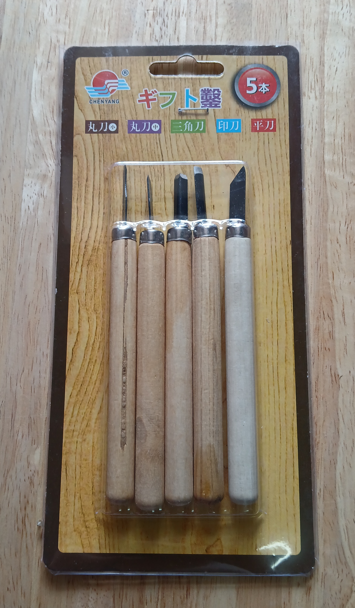
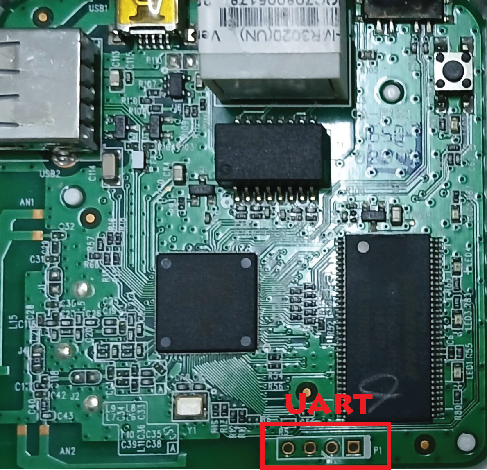
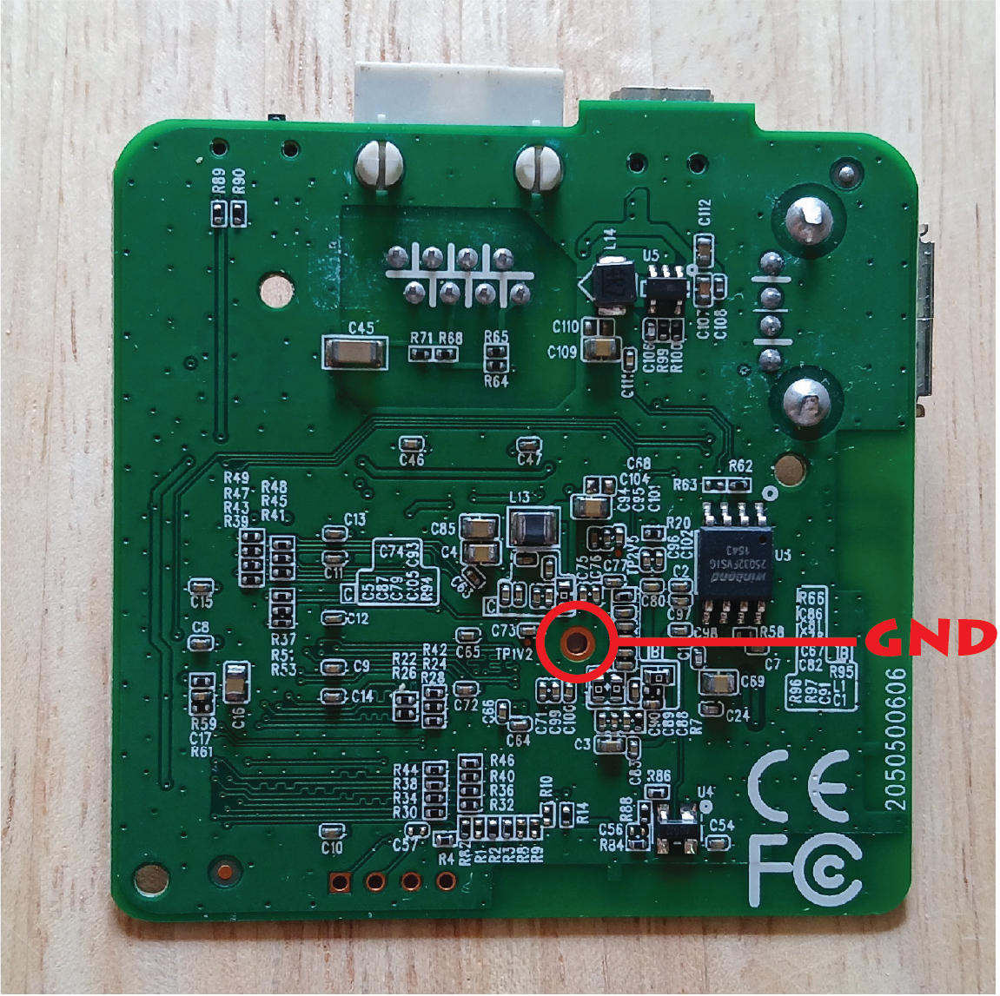
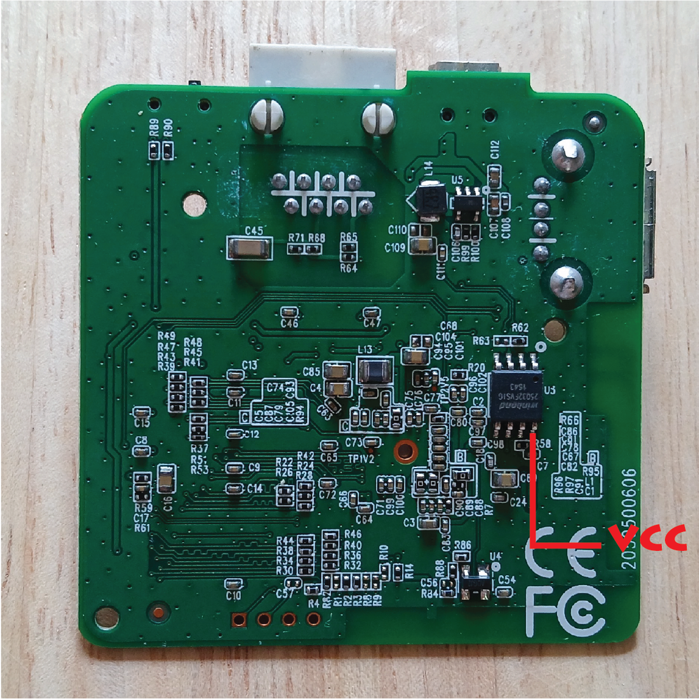
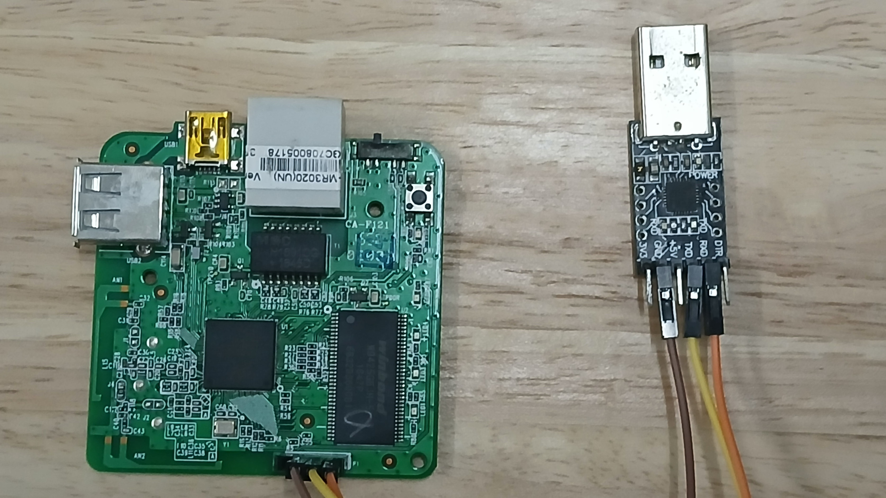

# Description 

This project demonstrates a reverse engineering process of a TP-Link router (model: TL-MR3020 v1) with the scope to find the vulnerabilities of an IoT device and to understand the components of an embedded Linux system. It includes identifying the components, accessing UART console,  boot log analysis, firmware extraction, getting the root file system and root access, and further firmware analysis. 


# Information Gathering

The information gathering process is based on three steps:

- **Searching information**, using the device name and manufacturer as search string.
- Opening the case and **inspecting the device**, identifying components and UART interface.
- **Getting the firmware** from the vendor web site or from the device flash memory.

## Searching information

Interesting Hardware Specifications: 
* **Device Model:** [TL-MR3020 V1](https://www.tp-link.com/us/support/download/tl-mr3020) 
* **CPU:** [Atheros AR9331](https://www.openhacks.com/uploadsproductos/ar9331_datasheet.pdf), MIPS 24K processor can run up to 400 MHz
* **RAM:** 32MB, device: Spansion S25FL032P
* **Flash memory:** 4MB, device: Winbond W9425G6JH

## Inspecting the device

|          |      |
| ------------------------------------------------------ | -------------------------------------------------------- |
|    |      |
|  |  |

### Opening the case

[This guide from OpenWrt website](https://openwrt.org/toh/tp-link/tl-mr3020) provided a more detailed instructions on how to open the case and better internal images than mine. In my case, a set of small and thin chisel tools like below is used to slowly lift the lid starting right above the ethernet port where the case is not glued.  
**!!! Be careful not to scratch the PCB traces and ports. 
(just because I also scratched the USB and Ethernet ports)**




### Finding UART Interface

UART (Universal Asynchronous Receiver/Transmitter), is a serial communication protocol used for transmitting data between two devices. It is very common in embedded devices and only uses two wires (TX and RX) with common a ground between transmitter and receiver to transmit and receive in both directions.

Obviously, from the board top view, we can spot the 4 pin connector, with pin 1 (P1) at top which can be the candidate for the UART interface. To find out which pins are TX, RX, GND and VCC, a multi-meter is used and took the following measurements.  





* First, measure the resistance of each pin relative to GND with the board powered off.
* Next, measure the resistance of each pin relative to VCC (using the [Winbond IC](https://www.datasheetmeta.com/search.php?q=25032BVSIG) as a reference) while the board remains power off
* Finally, power on the board and measure the voltage between each of the 4 pins and VCC.

A multimeter measures the average voltage over a few hundred milliseconds. During boot, UART transmits data, so TX pin will oscillate between 0V and 3.3V, resulting in fluctuating readings. If nothing is transmitted, the TX pin remains at 3.3V. 

| Pins | R(GND)  | R(VCC)  | V                  | Notes |
| ---- | ------- | ------- | ------------------ | ----- |
| ☐ 1  | 5.43 kΩ | 5.9 kΩ  | 2.7 V (oscillates) | TX    |
| 2    | 5.32 kΩ | 6.23 kΩ | 2.6 V (constant)   | RX    |
| 3    | **0 Ω** | 1.98 kΩ | **0 V**            | GND   |
| 4    | 1.97 kΩ | **0 Ω** | **3.3 V**          | VCC   |

Based on the above measurements, we can assume that 4 pin connector is the UART interface and the pinout is: **pin 1 (TX), pin 2 (RX), pin 3 (GND), pin 4 (VCC)**.

UART interface allows us to:

- View the boot log via the serial console
- Access the bootloader
- Dump the firmware
- Obtain a shell for device login

## Accessing UART console

To access UART console, we connect it to a PC with USB to TTL/Serial Adapter. ([CP2102](https://www.waveshare.com/cp2102-usb-uart-board-type-a.htm) is used)

- UART pin 1 (P1) TX  to TTL Adapter RX pin
- UART pin 2 RX to  TTL Adapter TX pin
- UART pin 3 GND to TTL Adapter GND pin
- Leave UART pin 4 VCC unconnected



On Linux host PC, we can use `picocom` to open the terminal over the serial port. 
It works with commonly used baud rate `115200` with no Parity and no Flow Control.

```
picocom -b 115200 /dev/ttyUSB0
```

Check the `/dev/[device name]` of serial adapter using the following command:
```
sudo dmesg | tail 
```

## Boot Log Analysis

We can get a lot of useful information when the device is booting. With `--logfile` option of `picocom`, we can record all the inputs and outputs of serial console in a text file.

```
picocom -b 115200 --logfile bootlog.txt /dev/ttyUSB0
```

From the boot log, 

* Bootloader is U-Boot version 1.1.4
```
U-Boot 1.1.4 (Sep 21 2015 - 17:19:07)
```

* DRAM and Flash memory size 
```
DRAM:  32 MB
led turning on for 1s...
id read 0x100000ff
flash size 4194304, sector count = 64
Flash:  4 MB
```

* Kernel image address on DRAM
```
## Booting image at 9f020000 ...
```

* Linux kernel version
```
Linux version 2.6.31--LSDK-9.2.0.312 (tomcat@buildserver) (gcc version 4.3.3 (GCC) ) #4 Mon Sep 21 17:19:36 CST 2015
```

* Kernel command line specifies the parameters on how kernel should boots up 
```
Kernel command line: console=ttyS0,115200 root=31:02 rootfstype=squashfs init=/sbin/init mtdparts=ar7240-nor0:128k(u-boot),1024k(kernel),2816(rootfs),64k(config),64k(ART) mem=32M
```

* Partitions on NOR Flash memory
```
Creating 5 MTD partitions on "ar7240-nor0":
0x000000000000-0x000000020000 : "boot"
0x000000020000-0x000000120000 : "kernel"
0x000000120000-0x0000003e0000 : "rootfs"
0x0000003e0000-0x0000003f0000 : "config"
0x0000003f0000-0x000000400000 : "art"
```

* Squashfs root filesystem is mounted
```
VFS: Mounted root (squashfs filesystem) readonly on device 31:2.
```

* BusyBox `init` is used
```
init started:  BusyBox v1.01 (2015.09.21-09:21+0000) multi-call binary
```

* After the booting process, login prompt is shown.
```
 TL-MR3020 mips #4 Mon Sep 21 17:19:36 CST 2015 (none)
TL-MR3020 login:
```

## Accessing U-Boot CLI

Before loading the kernel, we can access to the U-Boot CLI by entering specific keywords.
By searching on the internet, found out that sending "tpl" during auto boot delay can get access to the U-Boot commands.

```
Autobooting in 1 seconds
hornet>
```

At this point, we can now use the U-Boot commands. First, let's find out all the available commands.

```
hornet> help
?       - alias for 'help'
bootm   - boot application image from memory
cp      - memory copy
erase   - erase FLASH memory
help    - print online help
md      - memory display
mm      - memory modify (auto-incrementing)
mtest   - simple RAM test
mw      - memory write (fill)
nm      - memory modify (constant address)
printenv- print environment variables
progmac - Set ethernet MAC addresses
reset   - Perform RESET of the CPU
setenv  - set environment variables
tftpboot- boot image via network using TFTP protocol
version - print monitor version
```

There are some interesting commands such as `md` and `cp` to dump the contents of the memory, `bootm` for manually booting and using `tftpboot` to send the boot image over TFTP network. 

Next, let's take a look at the U-Boot environment variables.

```
hornet> printenv
bootargs=console=ttyS0,115200 root=31:02 rootfstype=squashfs init=/sbin/init mtdparts=ar7240-nor0:256k(u-boot),64k(u-boot-env),2752k(rootfs),896k(uImage),64k(NVRAM),64k(ART)
bootcmd=bootm 0x9f020000
bootdelay=1
baudrate=115200
ethaddr=0xba:0xbe:0xfa:0xce:0x07:0x41
ipaddr=192.168.1.111
serverip=192.168.1.100
stdin=serial
stdout=serial
stderr=serial
ethact=eth0

Environment size: 362/65532 bytes
```

In the next step, we will test some U-Boot commands and try to extract the firmware out of the memory.

## Extracting the Firmware

One way to extract the firmware and retrieve the root filesystem is through memory dumping. Alternatively, if available, the firmware can be downloaded directly from the vendor's website. 

### Method-1: Memory dumping 

With the list of available U-Boot commands, it is not possible to access the contents of the Flash memory. However, using [`md`](https://docs.u-boot.org/en/latest/usage/cmd/md.html) command, we can display the contents on **DRAM**. 

From the above boot info, kernel image is booted at the address `0x9f020000`. Since a SquashFS root filesystem is used, it is also possible for the root filesystem to be loaded into **DRAM**.

Using `md.b`, let's try to view the first few contents. This command displays the contents in bytes, starting from the specified `address`, and the number of values to be dumped, `length` have to be specified in hexadecimal. 

```
hornet> md.b 0x9f020000 10
9f020000: 01 00 00 00 54 50 2d 4c 49 4e 4b 20 54 65 63 68    ....TP-LINK Tech
```

As we can see, some of the readable contents are shown at the address `9f020000`.

Now, let's decide number of values to be dumped. The [firmware](https://www.tp-link.com/us/support/download/tl-mr3020/#Firmware) available on TP-Link's website is approximately 4MB. Therefore, the combined size of the kernel and squashfs root filesystem cannot exceed the original firmware size. The original firmware size is **4063744** bytes and converted into hexadecimal which is **0x3e0200**.

Before memory dumping, make sure `picocom` is quit and reopened with `--logfile` option to stored the dumped contents in a file.

```
picocom -b 115200 --logfile dump.txt /dev/ttyUSB0
```

Then, use `md.b` to display memory contents starting from the kernel load address `9f020000` up to the firmware size. It will take for a while. 

```
md.b 9f020000 0x3e0200
```

After that quit `picocom` and a file `dump.txt`is produced with strings in hexadecimal format. Next, prepare the file to get the following format which make it easier to convert into a `bin` file.

```
01 00 00 00 54 50 2d 4c 49 4e 4b 20 54 65 63 68
6e 6f 6c 6f 67 69 65 73 00 00 00 00 76 65 72 2e
20 31 2e 30 00 00 00 00 00 00 00 00 00 00 00 00
```

We can use a python script `hex2bin.py` included in this repository to convert the hexadecimal-formatted strings into a binary file.

```
python3 hex2bin.py dump.txt dump.bin
```

Now, a binary file `dump.bin` is obtained and we can analyze it using the [`binwalk`](https://www.kali.org/tools/binwalk/) command.

```
binwalk dump.bin
```

Apparently, the binary file contains a kernel image and a squashfs root filesystem compressed in LZMA format.

### Method-2: Downloading the Firmware

Since TP-Link provided with [firmware updates](https://www.tp-link.com/us/support/download/tl-mr3020/#Firmware) on the website, we can easily download the file and analyze it using `binwalk`. 

```
binwalk mr3020nv1_en_3_17_2_up_boot\(150921\).bin 
```

Using `binwalk`, we can understand that: 
* The firmware contains U-Boot, a Linux kernel, and a Squashfs root filesystem.
* There are also two header files, first one is uImage (U-Boot) header and second one is TP-Link firmware header.  
* The firmware uses LZMA compression.

## Getting the Root Filesystem

To obtain the root filesystem, we can extract it from either the *dumped binary file* or the *downloaded firmware file*. Using `binwalk -e` option, LZMA compressed file can be extracted. However, it will require some dependencies and one of which is [`sasquatch`](https://github.com/devttys0/sasquatch). Here's the [guide](https://www.linkedin.com/pulse/building-sasquatch-ubuntu-2404-daniel-darby-6ebie/) to build and install `sasquatch` on Ubuntu.

First, let's extract the *dumped binary file*.

```
binwalk -e dump.bin
```

Then, obtain the following files in the extracted directory including squashfs root filesystem.

```
100000.squashfs  200  200.7z  squashfs-root
```

Next, let's try to extract the *downloaded firmware file*.

```
binwalk -e mr3020nv1_en_3_17_2_up_boot\(150921\).bin
```

It includes the following files, and we can use `binwalk` on each uncompressed file for further analysis.

```
120200.squashfs  20400  20400.7z  3CC0  3CC0.7z  squashfs-root
```

Let's use `diff -qr` to compare the two `squashfs-root` directories and check if they are identical or not. If there's **no output**, the directories are **identical**. In my case, they are exactly the same. 

# Getting Root Access

Using the information from `/etc/passwd` and  `/etc/shadow` in the squashfs root filesystem, we can retrieve the username and password to log in as root. 

## Cracking the Hash

The hash passwords can be cracked using tools like [hashcat](https://hashcat.net/hashcat/) or [John the Ripper](https://www.openwall.com/john/). 
I used [John the Ripper](https://www.openwall.com/john/) tool. Also, I had already found the router's password on the internet, but I still wanted to verify it against the hash. To speed up the cracking process, I added the possible password `5up` to the `/usr/share/john/password.lst` wordlist.

From [this example](https://www.openwall.com/john/doc/EXAMPLES.shtml), to get a copy of our Unix password file, we can use John's `unshadow` utility.

```
unshadow /etc/passwd /etc/shadow > mypasswd
```

Then, I used John's [wordlist mode](https://www.openwall.com/john/doc/MODES.shtml) to crack the passwords. 

```
john --wordlist=/usr/share/john/password.lst --rules mypasswd
```

To display the contents of cracked passwords. Then, it showed exactly the same password we found on the internet. 

```
john --show mypasswd
root:5up:0:0:root:/root:/bin/sh
...
```

We can login to the router using the username `root` and password `5up`.

# Further Firmware Analysis

After gaining root access, we can now explore the contents of the Flash memory. 

## Transferring Flash memory contents over TFTP

To analyze the firmware stored in Flash memory, we can transfer the files to a Linux host using TFTP. 

### Connect the devices

* used an Ethernet connection between the host and the router for this transfer.
* **Set static IPs** on both devices in the same subnet.

Host
```
sudo ifconfig enp2s0 192.168.0.100 netmask 255.255.255.0 up
```

Router
```
ifconfig eth0 192.168.0.200 netmask 255.255.255.0 up
```

### Setting up TFTP server on the host

Install TFTP server on Linux machine.
```
sudo apt install tftpd-hpa -y
```

Create the TFTP directory.
```
mkdir -p /srv/tftp/tp-link-mr3020/
sudo chmod -R 777 /srv/tftp
sudo chown -R tftp:tftp /srv/tftp
```

Configure the TFTP Server.
```
TFTP_USERNAME="tftp"
TFTP_DIRECTORY="/srv/tftp/tp-link-mr3020"
TFTP_ADDRESS=":69"
TFTP_OPTIONS="--secure"
```

Restart the TFTP service.
```
sudo systemctl restart tftpd-hpa
sudo systemctl status tftpd-hpa 
```

### Transfer Files using TFTP

Check the partitions of Flash memory
```
# cat /proc/mtd
dev:    size   erasesize  name
mtd0: 00020000 00010000 "boot"
mtd1: 00100000 00010000 "kernel"
mtd2: 002c0000 00010000 "rootfs"
mtd3: 00010000 00010000 "config"
mtd4: 00010000 00010000 "art"
```

Create dummy files on TFTP server side
```
touch /srv/tftp/tp-link-mr3020/uboot.img
touch /srv/tftp/tp-link-mr3020/kernel.img
touch /srv/tftp/tp-link-mr3020/rootfs.img
touch /srv/tftp/tp-link-mr3020/config.img
touch /srv/tftp/tp-link-mr3020/art.img
```

Transfer files from `/dev/mtdblock0` to `/dev/mtdblock4` from router to Linux host
```
# tftp -l /dev/mtdblock0 -r uboot.img -p 192.168.0.100 
# tftp -l /dev/mtdblock1 -r kernel.img -p 192.168.0.100
# tftp -l /dev/mtdblock2 -r rootfs.img -p 192.168.0.100
# tftp -l /dev/mtdblock3 -r config.img -p 192.168.0.100
# tftp -l /dev/mtdblock4 -r art.img -p 192.168.0.100
```

After completing the transfer, we can now analyze the following image files on Linux host.
```
art.img  config.img  kernel.img  rootfs.img  uboot.img
```

## Analyze the Firmware

Before that we've explored the kernel and root filesystem, let's take a look at something we haven't examined yet: the `uboot.img`, `config.img`, `art.img`

Using `binwalk`, `hexdump` to display the contents in hex, and `strings` command to print string data, we can analyze each image.

```
hexdump -C uboot.img
```

```
strings uboot.img
```

# Emulating the Firmware

to-do-list

# References

**Websites:**
* [hacking-gemtek](https://github.com/digiampietro/hacking-gemtek)
* [OpenWrt TP-Link TL-MR3020](https://openwrt.org/toh/tp-link/tl-mr3020#tp-link_tl-mr3020)
* [Firmware dump over TFTP](https://nm-projects.de/2016/01/hacking-tl-mr3020-part-1-firmware-dump-over-tftp/)
* [Miniproject - Backdooring a TP-Link MR3020 router](https://jysec.fi/docs/0x001/JySec%200x001%20-%20Arttu%20Yla-Sahra%20-%20Device%20Hacking%20101%20-%20Backdooring_A_Router.pdf)

**Videos:**
* [Make Me Hack](https://www.youtube.com/@MakeMeHack)
* [Hacking an AT&T 4G Router For Fun and User Freedom](https://www.youtube.com/@mattbrwn)
* [Mastering UART Communication: Gaining Access & Extracting Firmware on Unknown Boards](https://www.youtube.com/@TechnicallyUnsure)


